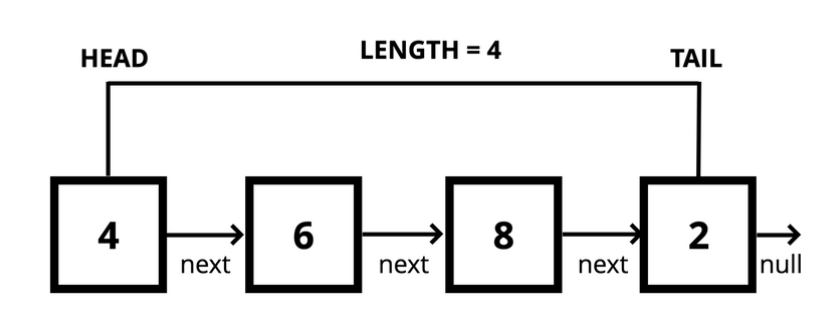

# Singly Linked List

From [geeksongeeks.com][geeks]:

> [A singly linked list] is the simplest type of linked list in which every node contains some data and a pointer to the next node of the same data type. The node contains a pointer to the next node means that the node stores the address of the next node in the sequence. A single linked list allows traversal of data only in one way

### Singly Linked List vs Array

| Lists                                       | Array                                       |
|---------------------------------------------|---------------------------------------------|
| Do not have indexes                         | Indexed in order                            |
| Connected via nodes with a **next** pointer | Insertion &amp; deletion can be expensive   |
| Random access is not allowed                | Can quickly be accessed at a specific index |

Singly linked list is preferred when we need to save memory and searching is not required as pointer of single index is stored.

[geeks]: https://www.geeksforgeeks.org/types-of-linked-list/#:~:text=Singly%20Linked%20List%3A%20It%20is,next%20node%20in%20the%20sequence.